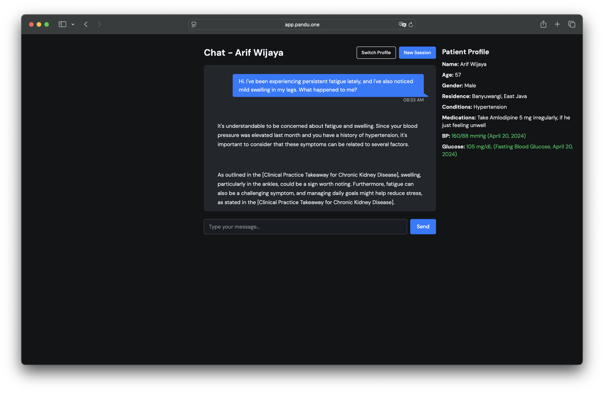
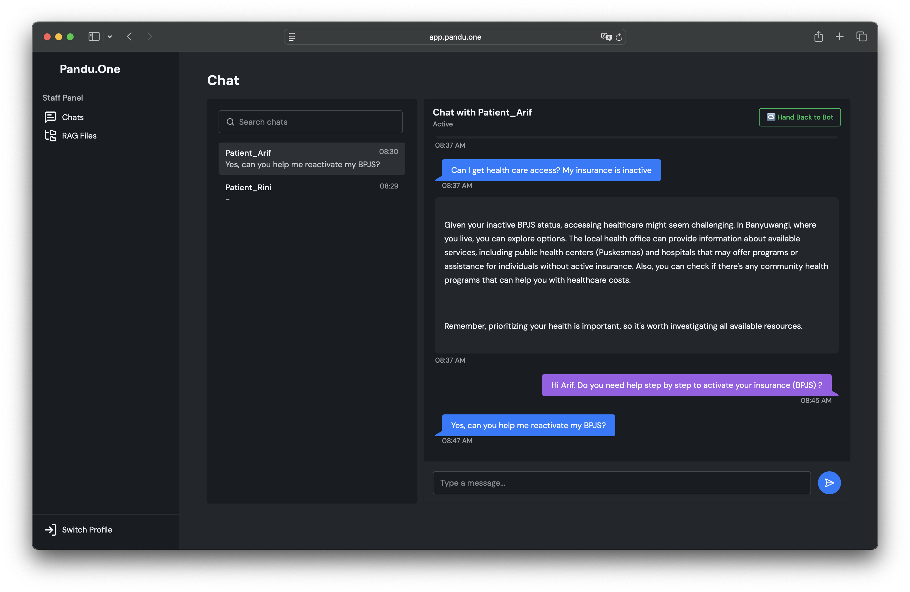
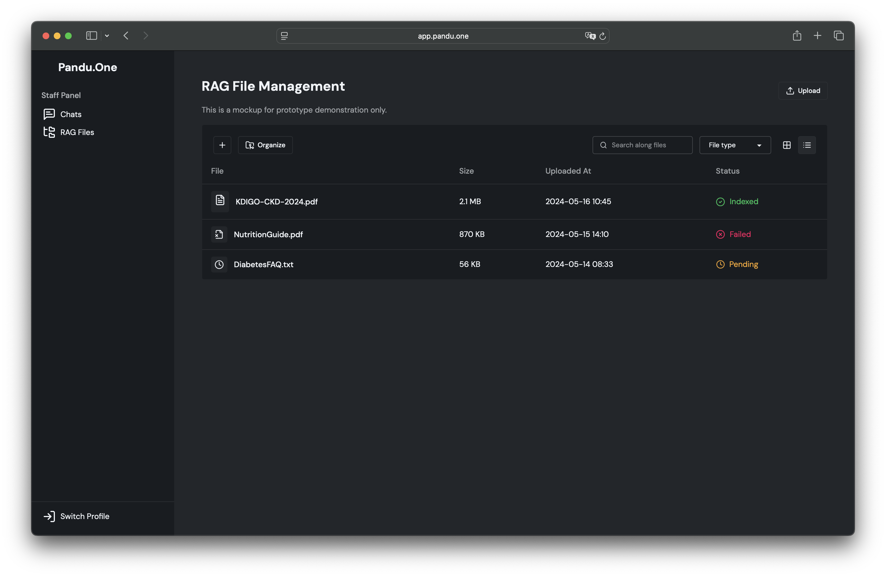

# PanduONE — Early CKD Education Chatbot

PanduONE is an AI-powered chatbot designed to support early detection and daily management of Chronic Kidney Disease (CKD) in Indonesia. By combining Retrieval-Augmented Generation (RAG) with Gemini API and tailored local health education, PanduONE bridges gaps in misinformation, limited clinical consultation time, and low CKD awareness.

🌐 [Try the prototype](https://app.pandu.one)

## 🧠 Why PanduONE?

Early-stage CKD is often asymptomatic, leading to underdiagnosis and delayed care. Patients struggle with:
- Limited consultation time with healthcare providers
- Misinformation from online sources
- Difficulty managing complex CKD regimens

PanduONE addresses these issues through an intelligent chatbot system, clinician-facing dashboard, and integration-ready design.

---

## 🚀 Features

### 🤖 Patient Chatbot (Powered by RAG & Gemini)
- 24/7 access to CKD education
- Personalized messages based on lab history & patient profile
- Localized & guideline-aligned responses
- Medication, diet, and hydration reminders

### 🩺 Staff Dashboard
- Monitor patient conversations
- Take over chat sessions as needed
- Receive summarized insights from patient behavior and concerns

### 📊 Analytics & RAG Management
- Upload documents for custom RAG sources (vectorized using FAISS)
- Summarized patient challenges for pre-visit preparation

---

## 🖼️ Screenshots

| Patient Chat View | Staff Dashboard | RAG File Manager |
|-------------------|------------------|------------------|
|  |  |  |

> _Note: Images are from prototype. Functional mock UI included._

---

## 🏗️ Architecture Overview

1. User query sent from frontend
2. Relevant context retrieved via FAISS DB
3. Gemini API generates context-aware response
4. Chat history updated, staff can optionally intervene
5. RAG documents managed via staff tools

Tech stack:
- **Frontend**: HTMX + Tailwind, Flutter (Planned)
- **Backend**: Django (Prototype), Golang (Production)
- **Data**: SQLite, Redis (Planned Pub/Sub) 
- **AI**: Gemini API, FAISS, Sentence-Transformers (`all-MiniLM-L6-v2`)
- **Infra**: Ubuntu (self-hosted)

---

## 📦 Installation (Prototype)

```bash
git clone https://github.com/Rizqip13/pandu.one-sehat.git
cd pandu.one-sehat
python -m venv venv
source venv/bin/activate
pip install -r requirements.txt

# Start Django server
python manage.py migrate
python manage.py runserver
```
Requires Python 3.10+, Redis, and Gemini API key


## Future Development

- Full RAG document upload support
- Bahasa Indonesia generation
- Integration with SATUSEHAT & telemedicine platforms
- Extension to other diseases (e.g., diabetes, cardiovascular)
- Appointment booking, meal planner, and hydration AI assistant


## 🤝 Acknowledgments
Built for the Gemini Hack2Skill APAC Solution Challenge